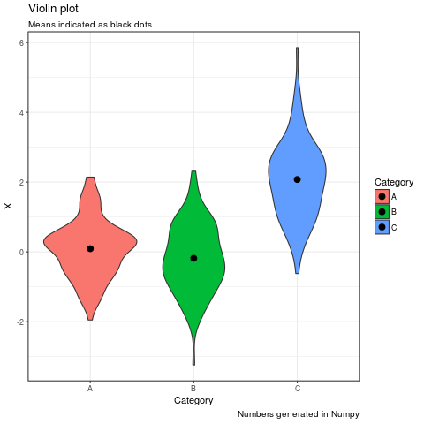

How to add R code to your (IPython) Jupyter Notebook. The notebook can be accessed from [Github](https://gist.github.com/simecek/019d87c55fec3839d95bbf8489dde61d).

```python
%load_ext rpy2.ipython
```


```python
import warnings
warnings.filterwarnings('ignore')
```


```python
%R require(ggplot2); require(tidyr)
```


    array([1], dtype=int32)


```python
import numpy as np
import pandas as pd 
np.random.seed(42)
# Make a pandas DataFrame
df = pd.DataFrame(np.random.normal(0,1,size=(100, 3)), columns=list('ABC'))
df['C'] = df['C'] + 2
```


```python
%%R -i df
df %>% 
  gather("Category", "X") %>%
  ggplot(aes(x = Category, y = X, fill = Category)) +
    geom_violin() +
    stat_summary(fun.y=mean, color='black', geom='point', size = 3) +
    labs(title = "Violin plot",
         subtitle = "Means indicated as black dots",
         captions = "Numbers generated in Numpy") +
    theme_bw()
```




